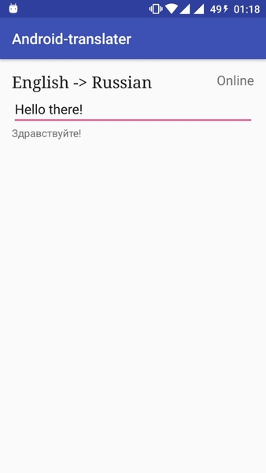

# android-translater
Simple English to Russian translator using Yandex translate api and with expandable JSON dictionary for offline usage.
At the moment offline dictionary consist of nearly 1600 words.

